# Convolutional Neural Network Visualizations 

This repository contains a number of convolutional neural network visualization techniques implemented in PyTorch.

**Note**: I removed cv2 dependencies and moved the repository towards PIL. A few things might be broken (although I tested all methods), I would appreciate if you could create an issue if something does not work.

**Note**: The code in this repository was tested with torch version 0.4.1 and some of the functions may not work as intended in later versions. Although it shouldn't be too much of an effort to make it work, I have no plans at the moment to make the code in this repository compatible with the latest version because I'm still using 0.4.1.

## Implemented Techniques

* [Gradient visualization with vanilla backpropagation](#gradient-visualization)
* [Gradient visualization with guided backpropagation](#gradient-visualization) [1]
* [Gradient visualization with saliency maps](#gradient-visualization) [4]
* [Gradient-weighted class activation mapping](#gradient-visualization) [3] (Generalization of [2]) 
* [Guided, gradient-weighted class activation mapping](#gradient-visualization) [3]
* [Score-weighted class activation mapping](#gradient-visualization) [15] (Gradient-free generalization of [2])
* [Element-wise gradient-weighted class activation mapping](#hierarchical-gradient-visualization) [16]
* [Smooth grad](#smooth-grad) [8]
* [CNN filter visualization](#convolutional-neural-network-filter-visualization) [9]
* [Inverted image representations](#inverted-image-representations) [5]
* [Deep dream](#deep-dream) [10]
* [Class specific image generation](#class-specific-image-generation) [4] [14]
* [Grad times image](#grad-times-image) [12]
* [Integrated gradients](#gradient-visualization) [13]
* [Layerwise relevance propagation](#gradient-visualization) [17]

## General Information

Depending on the technique, the code uses pretrained **AlexNet** or **VGG** from the model zoo. Some of the code also assumes that the layers in the model are separated into two sections; **features**, which contains the convolutional layers and **classifier**, that contains the fully connected layer (after flatting out convolutions). If you want to port this code to use it on your model that does not have such separation, you just need to do some editing on parts where it calls *model.features* and *model.classifier*.

Every technique has its own python file (e.g. *gradcam.py*) which I hope will make things easier to understand. *misc_functions.py* contains functions like image processing and image recreation which is shared by the implemented techniques.

All images are pre-processed with mean and std of the ImageNet dataset before being fed to the model. None of the code uses GPU as these operations are quite fast for a single image (except for deep dream because of the example image that is used for it is huge). You can make use of gpu with very little effort. The example pictures below include numbers in the brackets after the description, like *Mastiff (243)*, this number represents the class id in the ImageNet dataset.

I tried to comment on the code as much as possible, if you have any issues understanding it or porting it, don't hesitate to send an email or create an issue.

Below, are some sample results for each operation.

## Gradient Visualization
<table border=0 align=center>
	<tbody>
    <tr>
			<td>  </td>
			<td align="center"> Target class: King Snake (56) </td>
			<td align="center"> Target class: Mastiff (243) </td>
			<td align="center"> Target class: Spider (72)</td>
		</tr>
		<tr>
			<td width="19%" align="center"> Original Image </td>
			<td width="27%" >  </td>
			<td width="27%">  </td>
			<td width="27%">  </td>
		</tr>
		<tr>
			<td width="19%" align="center"> Colored Vanilla Backpropagation </td>
			<td width="27%" >  </td>
			<td width="27%">  </td>
			<td width="27%">  </td>
		</tr>
			<td width="19%" align="center"> Vanilla Backpropagation Saliency </td>
			<td width="27%" >  </td>
			<td width="27%">  </td>
			<td width="27%">  </td>
		</tr>
    <tr>
			<td width="19%" align="center"> Colored Guided Backpropagation <br />  <br />  (GB)</td>
			<td width="27%" >  </td>
			<td width="27%">  </td>
			<td width="27%">  </td>
		</tr>
    <tr>
			<td width="19%" align="center">Guided Backpropagation Saliency<br />  <br /> (GB)</td>
			<td width="27%" >  </td>
			<td width="27%">  </td>
			<td width="27%">  </td>
		</tr>
    <tr>
			<td width="19%" align="center">Guided Backpropagation Negative Saliency<br />  <br /> (GB)</td>
			<td width="27%" >  </td>
			<td width="27%">  </td>
			<td width="27%">  </td>
		</tr>
    <tr>
			<td width="19%" align="center">Guided Backpropagation Positive Saliency<br />  <br /> (GB)</td>
			<td width="27%" >  </td>
			<td width="27%">  </td>
			<td width="27%">  </td>
		</tr>
    <tr>
			<td width="19%" align="center"> Gradient-weighted Class Activation Map <br />  <br /> (Grad-CAM)</td>
			<td width="27%" >  </td>
			<td width="27%">  </td>
			<td width="27%">  </td>
		</tr>
    <tr>
			<td width="19%" align="center"> Gradient-weighted Class Activation Heatmap <br />  <br /> (Grad-CAM)</td>
			<td width="27%" >  </td>
			<td width="27%">  </td>
			<td width="27%">  </td>
		</tr>
    <tr>
			<td width="19%" align="center"> Gradient-weighted Class Activation Heatmap on Image <br />  <br /> (Grad-CAM)</td>
			<td width="27%" >  </td>
			<td width="27%">  </td>
			<td width="27%">  </td>
		</tr>
    <tr>
			<td width="19%" align="center"> Score-weighted Class Activation Map <br />  <br /> (Score-CAM)</td>
			<td width="27%" >  </td>
			<td width="27%">  </td>
			<td width="27%">  </td>
		</tr>
    <tr>
			<td width="19%" align="center"> Score-weighted Class Activation Heatmap <br />  <br /> (Score-CAM)</td>
			<td width="27%" >  </td>
			<td width="27%">  </td>
			<td width="27%">  </td>
		</tr>
    <tr>
			<td width="19%" align="center"> Score-weighted Class Activation Heatmap on Image <br />  <br /> (Score-CAM)</td>
			<td width="27%" >  </td>
			<td width="27%">  </td>
			<td width="27%">  </td>
		</tr>
    <tr>
			<td width="19%" align="center"> Colored Guided Gradient-weighted Class Activation Map <br />  <br /> (Guided-Grad-CAM)</td>
			<td width="27%" >  </td>
			<td width="27%">  </td>
			<td width="27%">  </td>
		</tr>
    <tr>
			<td width="19%" align="center"> Guided Gradient-weighted Class Activation Map Saliency <br />  <br /> (Guided-Grad-CAM)</td>
			<td width="27%" >  </td>
			<td width="27%">  </td>
			<td width="27%">  </td>
		</tr>
    <tr>
			<td width="19%" align="center"> Integrated Gradients <br /> (without image multiplication)  </td>
			<td width="27%" >  </td>
			<td width="27%">  </td>
			<td width="27%">  </td>
		</tr>
    <tr>
			<td width="19%" align="center"> Layerwise Relevance <br /> (LRP) - Layer 7  </td>
			<td width="27%" >  </td>
			<td width="27%">  </td>
			<td width="27%">  </td>
		</tr>
    <tr>
			<td width="19%" align="center"> Layerwise Relevance <br /> (LRP) - Layer 1  </td>
			<td width="27%" >  </td>
			<td width="27%">  </td>
			<td width="27%">  </td>
		</tr>
	</tbody>
</table>

## Hierarchical Gradient Visualization
LayerCAM [16] is a simple modification of Grad-CAM [3], which can generate reliable class activation maps from different layers. For the examples provided below, a pre-trained **VGG16** was used.

<table border=0 align=center>
	<tbody> 
    <tr>
			<td>  </td>
			<td align="center"> Class Activation Map </td>
			<td align="center"> Class Activation HeatMap </td>
			<td align="center"> Class Activation HeatMap on Image</td>
		</tr>
		<tr>
			<td width="19%" align="center"> LayerCAM <br /> (Layer 9)</td>
			<td width="27%" align="center"> 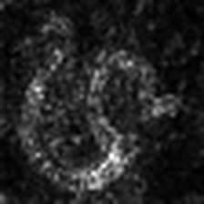 </td>
			<td width="27%" align="center"> 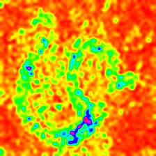 </td>
			<td width="27%" align="center"> 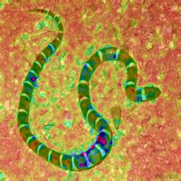 </td>
		</tr>
		<tr>
			<td width="19%" align="center"> LayerCAM <br /> (Layer 16)</td>
			<td width="27%" align="center"> 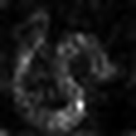 </td>
			<td width="27%" align="center"> 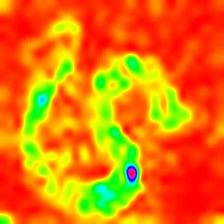 </td>
			<td width="27%" align="center"> 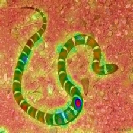 </td>
		</tr>
		<tr>
			<td width="19%" align="center"> LayerCAM <br /> (Layer 23)</td>
			<td width="27%" align="center"> 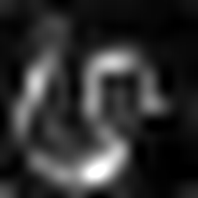 </td>
			<td width="27%" align="center"> 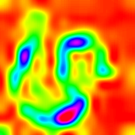 </td>
			<td width="27%" align="center"> 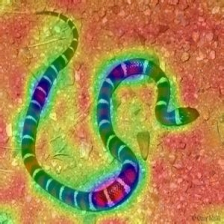 </td>
		</tr>
		<tr>
			<td width="19%" align="center"> LayerCAM <br /> (Layer 30)</td>
			<td width="27%" align="center"> 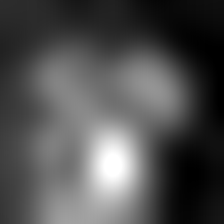 </td>
			<td width="27%" align="center"> 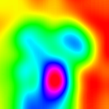 </td>
			<td width="27%" align="center"> 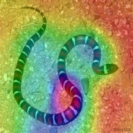 </td>
		</tr>
	</tbody>
</table>


## Grad Times Image
Another technique that is proposed is simply multiplying the gradients with the image itself. Results obtained with the usage of multiple gradient techniques are below.

<table border=0  align=center>
	<tbody> 
		<tr>
			<td width="19%" align="center"> Vanilla Grad <br /> <i>X</i> <br /> Image</td>
			<td width="27%" align="center">  </td>
			<td width="27%" align="center">  </td>
			<td width="27%" align="center">  </td>
		</tr>
		<tr>
			<td width="19%" align="center"> Guided Grad <br /> <i>X</i> <br /> Image</td>
			<td width="27%" align="center">  </td>
			<td width="27%" align="center">  </td>
			<td width="27%" align="center">  </td>
		</tr>
		<tr>
			<td width="19%" align="center"> Integrated Grad <br /> <i>X</i> <br /> Image</td>
			<td width="27%" align="center">  </td>
			<td width="27%" align="center">  </td>
			<td width="27%" align="center">  </td>
		</tr>
	</tbody>
</table>


## Smooth Grad
Smooth grad is adding some Gaussian noise to the original image and calculating gradients multiple times and averaging the results [8]. There are two examples at the bottom which use _vanilla_ and _guided_ backpropagation to calculate the gradients. Number of images (_n_) to average over is selected as 50. _σ_ is shown at the bottom of the images.

<table border=0 align=center>
	<tbody> 
    <tr>		<td width="27%" align="center"> </td>
			<td width="27%" align="center"> <strong>Vanilla Backprop</strong> </td>
			<td width="27%" align="center"> </td>
		</tr>
<tr>
			<td width="27%" align="center">  </td>
			<td width="27%" align="center">  </td>
			<td width="27%" align="center">  </td>
		</tr>
	</tbody>
</table>


<table border=0 align=center>
	<tbody> 
    <tr>		<td width="27%" align="center"> </td>
			<td width="27%" align="center"> <strong>Guided Backprop</strong> </td>
			<td width="27%" align="center"> </td>
		</tr>
<tr>
			<td width="27%" align="center">  </td>
			<td width="27%" align="center">  </td>
			<td width="27%" align="center">  </td>
		</tr>
	</tbody>
</table>

## Convolutional Neural Network Filter Visualization
CNN filters can be visualized when we optimize the input image with respect to output of the specific convolution operation. For this example I used a pre-trained **VGG16**. Visualizations of layers start with basic color and direction filters at lower levels. As we approach towards the final layer the complexity of the filters also increase. If you employ external techniques like blurring, gradient clipping etc. you will probably produce better images.

<table border=0 align=center>
	<tbody> 
		<tr>
			<td width="19%" align="center"> Layer 2 <br /> (Conv 1-2)</td>
			<td width="27%" align="center">  </td>
			<td width="27%" align="center">  </td>
			<td width="27%" align="center">  </td>
		</tr>
		<tr>
			<td width="19%" align="center"> Layer 10 <br /> (Conv 2-1)</td>
			<td width="27%" align="center">  </td>
			<td width="27%" align="center">  </td>
			<td width="27%" align="center">  </td>
		</tr>
		<tr>
			<td width="19%" align="center"> Layer 17 <br /> (Conv 3-1)</td>
			<td width="27%" align="center">  </td>
			<td width="27%" align="center">  </td>
			<td width="27%" align="center">  </td>
		</tr>
		<tr>
			<td width="19%" align="center"> Layer 24 <br /> (Conv 4-1)</td>
			<td width="27%" align="center">  </td>
			<td width="27%" align="center">  </td>
			<td width="27%" align="center">  </td>
		</tr>
	</tbody>
</table>

Another way to visualize CNN layers is to to visualize activations for a specific input on a specific layer and filter. This was done in [1] Figure 3. Below example is obtained from layers/filters of VGG16 for the first image using guided backpropagation. The code for this opeations is in *layer_activation_with_guided_backprop.py*. The method is quite similar to guided backpropagation but instead of guiding the signal from the last layer and a specific target, it guides the signal from a specific layer and filter. 

<table border=0 align=center>
	<tbody> 
    <tr>		<td width="27%" align="center"> Input Image </td>
			<td width="27%" align="center"> Layer Vis. (Filter=0)</td>
			<td width="27%" align="center"> Filter Vis. (Layer=29)</td>
		</tr>
<tr>
			<td width="27%">  </td>
			<td width="27%">  </td>
			<td width="27%" align="center">  </td>
		</tr>
	</tbody>
</table>


## Inverted Image Representations
I think this technique is the most complex technique in this repository in terms of understanding what the code does. It is mainly because of complex regularization. If you truly want to understand how this is implemented I suggest you read the second and third page of the paper [5], specifically, the regularization part. Here, the aim is to generate original image after nth layer. The further we go into the model, the harder it becomes. The results in the paper are incredibly good (see Figure 6) but here, the result quickly becomes messy as we iterate through the layers. This is because the authors of the paper tuned the parameters for each layer individually. You can tune the parameters just like the to ones that are given in the paper to optimize results for each layer. The inverted examples from several layers of **AlexNet** with the previous *Snake* picture are below.


<table border=0 align=center>
	<tbody> 
    <tr>		<td width="27%" align="center"> Layer 0: <strong>Conv2d</strong> </td>
			<td width="27%" align="center"> Layer 2: <strong>MaxPool2d</strong> </td>
			<td width="27%" align="center"> Layer 4: <strong>ReLU</strong> </td>
		</tr>
		<tr>
			<td width="27%" align="center">  </td>
			<td width="27%" align="center">  </td>
			<td width="27%" align="center">  </td>
		</tr>
	</tbody>
</table>
<table border=0 align=center>
	<tbody> 
    <tr>		<td width="27%" align="center"> Layer 7: <strong>ReLU</strong> </td>
			<td width="27%" align="center"> Layer 9: <strong>ReLU</strong> </td>
			<td width="27%" align="center"> Layer 12: <strong>MaxPool2d</strong> </td>
		</tr>
		<tr>
			<td width="27%" align="center">  </td>
			<td width="27%" align="center">  </td>
			<td width="27%" align="center">  </td>
		</tr>
	</tbody>
</table>


## Deep Dream
Deep dream is technically the same operation as layer visualization the only difference is that you don't start with a random image but use a real picture. The samples below were created with **VGG19**, the produced result is entirely up to the filter so it is kind of hit or miss. The more complex models produce mode high level features. If you replace **VGG19** with an **Inception** variant you will get more noticable shapes when you target higher conv layers. Like layer visualization, if you employ additional techniques like gradient clipping, blurring etc. you might get better visualizations.

<table border=0 align=center>
	<tbody>
		<tr>
			<td width="19%" align="center">Original Image</td>
			<td width="70%" align="center">  </td>
		</tr>
		<tr>
			<td width="19%" align="center">VGG19 <br /> Layer: 34  <br /> (Final Conv. Layer) Filter: 94</td>
			<td width="70%" align="center">  </td>
		</tr>
		<tr>
			<td width="19%" align="center">VGG19 <br /> Layer: 34  <br /> (Final Conv. Layer) Filter: 103</td>
			<td width="70%" align="center">  </td>
		</tr>
	</tbody>
</table>


## Class Specific Image Generation
This operation produces different outputs based on the model and the applied regularization method. Below, are some samples produced with **VGG19** incorporated with Gaussian blur every other iteration (see [14] for details). The quality of generated images also depend on the model, **AlexNet** generally has green(ish) artifacts but VGGs produce (kind of) better images. Note that these images are generated with regular CNNs with optimizing the input and **not with GANs**.

<table border=0 align=center>
	<tbody>
    <tr>
			<td width="27%" align="center"> Target class: Worm Snake (52) - (VGG19) </td>
			<td width="27%" align="center"> Target class: Spider (72) - (VGG19) </td>
		</tr>
		<tr>
			<td width="27%" align="center">  </td>
			<td width="27%" align="center">  </td>
		</tr>
	</tbody>
</table>

The samples below show the produced image with no regularization, l1 and l2 regularizations on target class: **flamingo** (130) to show the differences between regularization methods. These images are generated with a pretrained AlexNet. 

<table border=0 align="center">
	<tbody> 
    <tr>		<td width="27%" align="center"> No Regularization </td>
			<td width="27%" align="center"> L1 Regularization </td>
			<td width="27%" align="center"> L2 Regularization </td>
		</tr>
		<tr>
			<td width="27%" align="center">  </td>
			<td width="27%" align="center">  </td>
			<td width="27%" align="center">  </td>
		</tr>
	</tbody>
</table>


Produced samples can further be optimized to resemble the desired target class, some of the operations you can incorporate to improve quality are; blurring, clipping gradients that are below a certain treshold, random color swaps on some parts, random cropping the image, forcing generated image to follow a path to force continuity.

Some of these techniques are implemented in *generate_regularized_class_specific_samples.py* (courtesy of [alexstoken](https://github.com/alexstoken)).

## Requirements:
```
torch == 0.4.1
torchvision >= 0.1.9
numpy >= 1.13.0
matplotlib >= 1.5
PIL >= 1.1.7
```

## Citation

If you find the code in this repository useful for your research consider citing it.

	@misc{uozbulak_pytorch_vis_2022,
	  author = {Utku Ozbulak},
	  title = {PyTorch CNN Visualizations},
	  year = {2019},
	  publisher = {GitHub},
	  journal = {GitHub repository},
	  howpublished = {\url{https://github.com/utkuozbulak/pytorch-cnn-visualizations}},
	  commit = {b7e60adaf64c9be97b480509285718603d1e9ba4}
	}
	
## References:

[1] J. T. Springenberg, A. Dosovitskiy, T. Brox, and M. Riedmiller. *Striving for Simplicity: The All Convolutional Net*, https://arxiv.org/abs/1412.6806

[2] B. Zhou, A. Khosla, A. Lapedriza, A. Oliva, A. Torralba. *Learning Deep Features for Discriminative Localization*, https://arxiv.org/abs/1512.04150

[3] R. R. Selvaraju, A. Das, R. Vedantam, M. Cogswell, D. Parikh, and D. Batra. *Grad-CAM: Visual Explanations from Deep Networks via Gradient-based Localization*, https://arxiv.org/abs/1610.02391

[4] K. Simonyan, A. Vedaldi, A. Zisserman. *Deep Inside Convolutional Networks: Visualising Image Classification Models and Saliency Maps*, https://arxiv.org/abs/1312.6034

[5] A. Mahendran, A. Vedaldi. *Understanding Deep Image Representations by Inverting Them*, https://arxiv.org/abs/1412.0035

[6] H. Noh, S. Hong, B. Han,  *Learning Deconvolution Network for Semantic Segmentation* https://www.cv-foundation.org/openaccess/content_iccv_2015/papers/Noh_Learning_Deconvolution_Network_ICCV_2015_paper.pdf

[7] A. Nguyen, J. Yosinski, J. Clune.  *Deep Neural Networks are Easily Fooled: High Confidence Predictions for Unrecognizable  Images* https://arxiv.org/abs/1412.1897

[8] D. Smilkov, N. Thorat, N. Kim, F. Viégas, M. Wattenberg. *SmoothGrad: removing noise by adding noise* https://arxiv.org/abs/1706.03825

[9] D. Erhan, Y. Bengio, A. Courville, P. *Vincent. Visualizing Higher-Layer Features of a Deep Network* https://www.researchgate.net/publication/265022827_Visualizing_Higher-Layer_Features_of_a_Deep_Network

[10] A. Mordvintsev, C. Olah, M. Tyka. *Inceptionism: Going Deeper into Neural Networks* https://research.googleblog.com/2015/06/inceptionism-going-deeper-into-neural.html

[11] I. J. Goodfellow, J. Shlens, C. Szegedy. *Explaining and Harnessing Adversarial Examples* https://arxiv.org/abs/1412.6572

[12] A. Shrikumar, P. Greenside, A. Shcherbina, A. Kundaje. *Not Just a Black Box: Learning Important Features Through Propagating Activation Differences* https://arxiv.org/abs/1605.01713

[13] M. Sundararajan, A. Taly, Q. Yan. *Axiomatic Attribution for Deep Networks* https://arxiv.org/abs/1703.01365

[14] J. Yosinski, J. Clune, A. Nguyen, T. Fuchs, Hod Lipson, *Understanding Neural Networks Through Deep Visualization* https://arxiv.org/abs/1506.06579

[15] H. Wang, Z. Wang, M. Du, F. Yang, Z. Zhang, S. Ding, P. Mardziel, X. Hu. *Score-CAM: Score-Weighted Visual Explanations for Convolutional Neural Networks* https://arxiv.org/abs/1910.01279

[16] P. Jiang, C. Zhang, Q. Hou, M. Cheng, Y. Wei. LayerCAM: *Exploring Hierarchical Class Activation Maps for Localization* http://mmcheng.net/mftp/Papers/21TIP_LayerCAM.pdf

[17] G. Montavon1, A. Binder, S. Lapuschkin, W. Samek, and K. Muller. *Layer-Wise Relevance Propagation: An Overview* https://www.researchgate.net/publication/335708351_Layer-Wise_Relevance_Propagation_An_Overview

